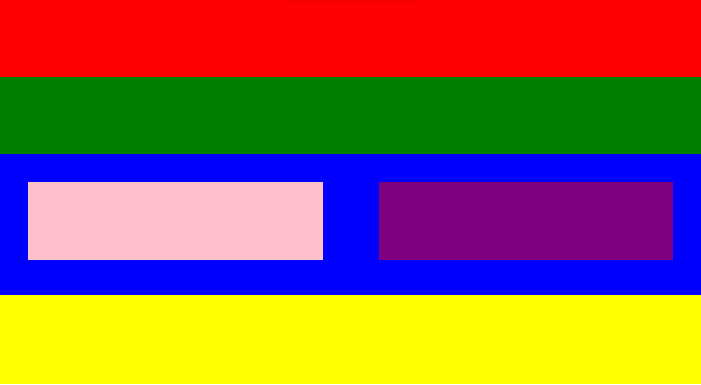

Look how colors come together to make world beautiful. 
Out of many i use only few of them and of course it follows symmetricity 
Many->RGB combination 
 
This is the result of the code written in HTML and CSS

